# Agent Delegation Flow

This document explains the workflow between different agents in the `.claude/agents/` directory, starting with the tech-lead agent.

## Agents Overview

### 🔴 Tech Lead
**Role**: Lead engineer who designs technical implementations and orchestrates the development workflow

**Responsibilities**:
- Read and analyze feature specifications
- Design technical implementation plans in `[feature-name].md`
- Delegate implementation to senior-engineer
- Coordinate code review cycles
- Validate final implementation against design
- Clean up planning documents when complete

### 🔵 Senior Engineer
**Role**: Experienced software engineer who implements features according to technical specifications

**Responsibilities**:
- Implement features based on tech-lead's design document
- Write clean, maintainable, well-structured code
- Follow best practices and coding standards
- Add appropriate comments and documentation
- Implement error handling and edge cases
- Write initial tests

### 🟢 Code Reviewer
**Role**: Expert code reviewer focused on quality, maintainability, and best practices

**Responsibilities**:
- Review code for correctness, quality, and adherence to standards
- Identify bugs, security issues, and performance problems
- Suggest improvements for readability and maintainability
- Verify alignment with technical design
- Provide constructive, actionable feedback categorized by priority

### 🟡 QA Tester
**Role**: Quality assurance specialist who tests the implementation end-to-end

**Responsibilities**:
- Create test plans
- Execute manual testing
- Verify edge cases
- Report bugs with reproduction steps

### 🟣 Tech Writer
**Role**: Technical writer who creates end-user and developer documentation

**Responsibilities**:
- API documentation
- User guides
- Architecture diagrams
- README updates

## Workflow Diagram

```mermaid
flowchart TD
    Start([User provides feature requirement]) --> TechLead[🔴 Tech Lead]

    TechLead --> |Creates design document| Design[feature-name.md]
    Design --> |Delegates implementation| Engineer[🔵 Senior Engineer]

    Engineer --> |Implements feature| Code[Implementation Complete]
    Code --> |Submits for review| TechLead

    TechLead --> |Sends to review| Reviewer[🟢 Code Reviewer]

    Reviewer --> |Provides feedback| ReviewDecision{Review Result}

    ReviewDecision --> |Critical/High Priority Issues| TechLead
    TechLead --> |Prioritizes & delegates fixes| Engineer

    ReviewDecision --> |Approved| TechLead
    TechLead --> |Final validation| Validate{Meets Design?}

    Validate --> |Issues found| Reviewer
    Validate --> |Approved| QA[🟡 QA Tester]

    QA --> |End-to-end testing| QADecision{Tests Pass?}
    QADecision --> |Bugs found| TechLead
    QADecision --> |Tests pass| TechLead

    TechLead --> |Feature approved| Writer[🟣 Tech Writer]
    Writer --> |Creates documentation| Complete([Feature Complete])

    TechLead --> |Cleans up design docs| Complete

    style TechLead fill:#ff6b6b
    style Engineer fill:#4dabf7
    style Reviewer fill:#51cf66
    style QA fill:#ffd43b
    style Writer fill:#cc5de8
    style Start fill:#e9ecef
    style Complete fill:#e9ecef
```

## Detailed Workflow Stages

### Stage 1: Planning & Design
1. **Tech Lead** receives feature requirement from user
2. Creates `[feature-name].md` with:
   - Architecture decisions
   - Component/module breakdown
   - Data flow and interfaces
   - Edge cases and error handling
   - Testing strategy

### Stage 2: Implementation
3. **Tech Lead** delegates to **Senior Engineer** with clear requirements
4. **Senior Engineer** implements the feature:
   - Reads design document thoroughly
   - Follows specified architecture
   - Writes clean, maintainable code
   - Implements error handling
   - Writes initial tests
   - Signals completion to **Tech Lead**

### Stage 3: Code Review Cycle
5. **Tech Lead** sends code to **Code Reviewer**
6. **Code Reviewer** evaluates and categorizes issues:
   - **Critical** (Blocking): Bugs, security, performance, missing error handling
   - **High Priority**: Code duplication, poor naming, missing tests
   - **Nice-to-Have**: Minor style, refactoring opportunities
7. **Tech Lead** processes feedback:
   - Prioritizes issues
   - Sends high-priority changes back to **Senior Engineer**
   - Repeats until **Code Reviewer** approves

### Stage 4: Final Validation
8. **Tech Lead** performs final validation:
   - Compares implementation to design document
   - Verifies all requirements met
   - If issues found, returns to code review
   - If approved, proceeds to QA

### Stage 5: Quality Assurance
9. **QA Tester** performs end-to-end testing:
   - Creates test plans
   - Executes manual testing
   - Verifies edge cases
   - Reports bugs if found (returns to **Tech Lead**)
   - Confirms feature works as expected

### Stage 6: Documentation & Completion
10. **Tech Lead** approves feature for completion
11. **Tech Writer** creates documentation:
    - API documentation
    - User guides
    - Architecture diagrams
    - README updates
12. **Tech Lead** cleans up `[feature-name].md` and marks feature complete

## Key Principles

- **Tech Lead** is the central orchestrator and decision-maker
- Clear communication and handoffs between agents
- Iterative code review process until quality standards met
- Systematic validation at each stage
- Documentation created after feature approval
- Planning documents cleaned up after completion