# Agent Delegation Flow

This document explains the workflow between different agents in the `.claude/agents/` directory, starting with the tech-lead agent.

## Agents Overview

### 🔴 Tech Lead
**Role**: Lead engineer who designs technical implementations and provides strategic oversight at key checkpoints

**Responsibilities**:
- Read and analyze feature specifications
- Design technical implementation plans in `[feature-name].md`
- Delegate to tech-writer for initial intended documentation
- Validate implementation at phase boundaries (3 checkpoints)
- Make final approval decision
- Clean up planning documents when complete

**Autonomy Level**: Strategic oversight only - trusts team autonomy within phases

### 🔵 Senior Engineer
**Role**: Experienced software engineer who implements features and iterates autonomously with code-reviewer

**Responsibilities**:
- Implement features based on tech-lead's design document
- Write clean, maintainable, well-structured code
- Follow best practices and coding standards
- Work autonomously with code-reviewer until approval (max 3 cycles)
- Work autonomously with qa-tester to fix bugs (max 3 cycles)
- Escalate to tech-lead if loop limits reached

**Autonomy Level**: High - self-manages review and QA cycles

### 🟢 Code Reviewer
**Role**: Expert code reviewer who works directly with senior-engineer to iterate until code meets standards

**Responsibilities**:
- Review code for correctness, quality, and adherence to standards
- Identify bugs, security issues, and performance problems
- Provide feedback directly to senior-engineer (not via tech-lead)
- Iterate autonomously until approval (max 3 review cycles)
- Escalate to tech-lead if issues persist after 3 cycles

**Autonomy Level**: High - direct peer collaboration with senior-engineer

### 🟡 QA Tester
**Role**: Quality assurance specialist who tests implementation and works autonomously with senior-engineer

**Responsibilities**:
- Create comprehensive test plans based on design document
- Execute manual and automated testing
- Work autonomously with senior-engineer to fix bugs (max 3 cycles)
- Report completion to tech-lead when tests pass
- Escalate to tech-lead if issues persist after 3 cycles

**Autonomy Level**: High - self-manages testing and bug fix cycles

### 🟣 Tech Writer
**Role**: Technical writer who creates documentation at the beginning and end of the development cycle

**Responsibilities**:
- Create initial intended documentation based on tech-lead's design
- Create final documentation after implementation is complete
- Generate drift.md comparing intended vs actual implementation
- Show what changed and why during development

**Autonomy Level**: Medium - bookends the process with documentation snapshots

## Workflow Diagram

```mermaid
flowchart TD
    Start([User provides feature requirement]) --> TechLead1[🔴 Tech Lead]

    TechLead1 --> |Creates design document| Design[feature-name.md]
    Design --> |Delegates for intended docs| Writer1[🟣 Tech Writer]
    Writer1 --> |Creates intended-docs.md| IntendedDocs[feature-name-intended-docs.md]

    IntendedDocs --> |Delegates implementation| Engineer[🔵 Senior Engineer]

    Engineer --> |Implements & auto-invokes| Reviewer[🟢 Code Reviewer]

    Reviewer --> |Reviews code| ReviewDecision{Meets Standards?}
    ReviewDecision --> |Issues found| ReviewCount{Review Cycle < 3?}
    ReviewCount --> |Yes| Engineer
    ReviewCount --> |No - Escalate| TechLead2[🔴 Tech Lead<br/>CHECKPOINT 1]

    ReviewDecision --> |Approved| TechLead2

    TechLead2 --> |Validates design| Validate{Meets Design?}
    Validate --> |Issues found| Engineer
    Validate --> |Approved| QA[🟡 QA Tester]

    QA --> |Tests implementation| QADecision{Tests Pass?}
    QADecision --> |Bugs found| QACount{Test Cycle < 3?}
    QACount --> |Yes| Engineer
    QACount --> |No - Escalate| TechLead3[🔴 Tech Lead<br/>CHECKPOINT 2]

    QADecision --> |All tests pass| TechLead3

    TechLead3 --> |Approves for docs| Writer2[🟣 Tech Writer]
    Writer2 --> |Creates final docs & drift.md| FinalDocs[Final Documentation]

    FinalDocs --> |Final review| TechLead4[🔴 Tech Lead<br/>CHECKPOINT 3]
    TechLead4 --> |Cleans up & approves| Complete([Feature Complete])

    style TechLead1 fill:#ff6b6b
    style TechLead2 fill:#ff6b6b
    style TechLead3 fill:#ff6b6b
    style TechLead4 fill:#ff6b6b
    style Engineer fill:#4dabf7
    style Reviewer fill:#51cf66
    style QA fill:#ffd43b
    style Writer1 fill:#cc5de8
    style Writer2 fill:#cc5de8
    style Start fill:#e9ecef
    style Complete fill:#e9ecef

    %% Highlight autonomous cycles
    style ReviewDecision fill:#ffe066,stroke:#fab005,stroke-width:3px
    style QADecision fill:#ffe066,stroke:#fab005,stroke-width:3px
```

## Detailed Workflow Stages

### Stage 1: Planning & Design
1. **Tech Lead** receives feature requirement from user
2. Creates `[feature-name].md` with:
   - Architecture decisions
   - Component/module breakdown
   - Data flow and interfaces
   - Edge cases and error handling
   - Testing strategy

### Stage 2: Initial Documentation
3. **Tech Lead** delegates to **Tech Writer** for intended documentation
4. **Tech Writer** creates `[feature-name]-intended-docs.md`:
   - Feature overview and purpose
   - Intended API/interface design
   - Expected usage examples
   - Planned architecture
   - Anticipated edge cases and limitations

### Stage 3: Implementation
5. **Tech Lead** delegates to **Senior Engineer** with design document
6. **Senior Engineer** implements the feature:
   - Reads design document thoroughly
   - Follows specified architecture
   - Writes clean, maintainable code
   - Implements error handling
   - Writes initial tests
   - **Automatically invokes Code Reviewer when complete**

### Stage 4: Autonomous Code Review Cycle (Max 3 Iterations)
7. **Senior Engineer** ↔ **Code Reviewer** work directly together:
   - **Code Reviewer** evaluates and categorizes issues:
     - **Critical** (Blocking): Bugs, security, performance, missing error handling
     - **High Priority**: Code duplication, poor naming, missing tests
     - **Nice-to-Have**: Minor style, refactoring opportunities
   - **Senior Engineer** addresses feedback and re-submits
   - Cycle repeats up to 3 times
   - If approved: **Code Reviewer** reports to **Tech Lead**
   - If 3 cycles reached without approval: escalate to **Tech Lead**

### Stage 5: CHECKPOINT 1 - Design Validation
8. **Tech Lead** performs validation:
   - Compares implementation to design document
   - Verifies all requirements met
   - If issues found, sends back to **Senior Engineer**
   - If approved, proceeds to **QA Tester**

### Stage 6: Autonomous QA Cycle (Max 3 Iterations)
9. **QA Tester** ↔ **Senior Engineer** work directly together:
   - **QA Tester** creates test plan and executes comprehensive testing
   - If bugs found: sends reports directly to **Senior Engineer**
   - **Senior Engineer** fixes issues and notifies **QA Tester**
   - Cycle repeats up to 3 times
   - If tests pass: **QA Tester** reports to **Tech Lead**
   - If 3 cycles reached with bugs: escalate to **Tech Lead**

### Stage 7: CHECKPOINT 2 - QA Approval
10. **Tech Lead** reviews test results
11. If approved, delegates to **Tech Writer** for final documentation

### Stage 8: Final Documentation & Drift Analysis
12. **Tech Writer** creates final deliverables:
    - Final end-user and developer documentation
    - `drift.md` comparing intended vs actual implementation:
      - Side-by-side comparison
      - Reasons for deviations
      - Impact analysis (major vs minor drifts)
      - Summary of what changed and why

### Stage 9: CHECKPOINT 3 - Final Approval
13. **Tech Lead** performs final review:
    - Reviews final documentation and drift analysis
    - Verifies feature is complete and well-documented
    - Cleans up `[feature-name].md`
    - Marks feature complete

## Key Principles

### Hybrid Autonomy Model
- **Tech Lead** provides strategic oversight at 3 key checkpoints, not continuous coordination
- Agents work autonomously within their phases (review cycle, QA cycle)
- Direct peer-to-peer collaboration between senior-engineer, code-reviewer, and qa-tester
- Escalation to tech-lead only when needed (approval or hitting loop limits)

### Loop Safety
- All autonomous cycles limited to 3 iterations maximum
- Prevents infinite loops and ensures progress
- Automatic escalation to tech-lead if limits reached
- Tech-lead can intervene with architectural guidance

### Documentation Drift Tracking
- Tech-writer creates intended documentation upfront
- Final documentation includes drift analysis (drift.md)
- Shows what changed from plan to implementation
- Provides visibility into how solutions evolve during development

### Quality Gates
- Systematic validation at checkpoint boundaries
- Code must pass review before tech-lead validation
- Implementation must pass tech-lead validation before QA
- QA must pass before final documentation
- Clear approval criteria at each stage

### Communication Flow
- Within phases: Direct agent-to-agent communication
- At checkpoints: Reports and validations through tech-lead
- Escalations: Detailed summaries with recommendations
- Documentation: Comprehensive drift analysis for stakeholders